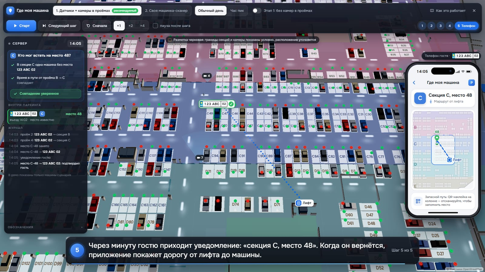
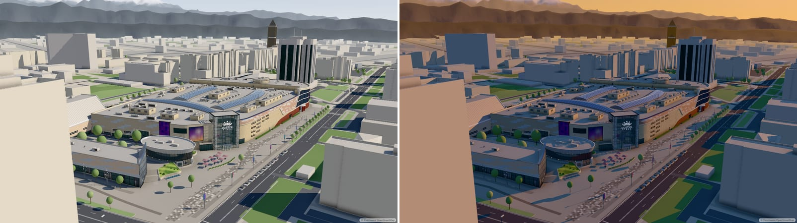

# Dostyk Plaza 3D — демо

Интерактивная 3D-модель ТРЦ Dostyk Plaza (Алматы) для приложения Smart Plaza. Здесь лежит собранный вьюер (без исходников); сайт закрыт от поисковиков.

## Версии

| Версия | Что внутри | Открыть | Один файл |
|---|---|---|---|
| **v6 — «Где моя машина»** (10.10.2026) | демо для докладчика на модели паркинга: два способа узнать, где стоит машина гостя, и текст «Как это работает» | [режим 1](https://daulet-rama.github.io/dostyk-plaza-3d-demo/car/car-demo.html) · [режим 2](https://daulet-rama.github.io/dostyk-plaza-3d-demo/car/car-demo.html?variant=2) · [Как это работает](https://daulet-rama.github.io/dostyk-plaza-3d-demo/car/how-it-works.html) | [embed.html](https://daulet-rama.github.io/dostyk-plaza-3d-demo/car/embed.html?demo=car) |
| v5 — тени (09.10.2026) | всё из v4 + тени солнца по эталону Blender Cycles, новый вечер | [shadows/](https://daulet-rama.github.io/dostyk-plaza-3d-demo/shadows/) | [embed.html](https://daulet-rama.github.io/dostyk-plaza-3d-demo/shadows/embed.html) |
| v4 — «Найти путь» | QR на колонне → поиск магазина → маршрут по 1 этажу; «к машине» на паркинг | [route/](https://daulet-rama.github.io/dostyk-plaza-3d-demo/route/) · [автозапуск](https://daulet-rama.github.io/dostyk-plaza-3d-demo/route/?demo=route) | [embed.html](https://daulet-rama.github.io/dostyk-plaza-3d-demo/route/embed.html) |
| v3 — 1 этаж | помещения, арендаторы, поиск по номеру — по плану управляющей компании; паркинг | [l1/](https://daulet-rama.github.io/dostyk-plaza-3d-demo/l1/) | [embed.html](https://daulet-rama.github.io/dostyk-plaza-3d-demo/l1/embed.html) |
| v2 — паркинг | подземный паркинг (отм. −4.050) по плану управляющей компании | [parking/](https://daulet-rama.github.io/dostyk-plaza-3d-demo/parking/) | [embed.html](https://daulet-rama.github.io/dostyk-plaza-3d-demo/parking/embed.html) |
| v1 — экстерьер | здание, площадь и город вокруг | [открыть](https://daulet-rama.github.io/dostyk-plaza-3d-demo/) | [embed.html](https://daulet-rama.github.io/dostyk-plaza-3d-demo/embed.html) |

«Один файл» — тот же вьюер одной страницей с моделью внутри: так его встраивают в приложение (WebView), работает и без сети.

## Что нового в v6: «Где моя машина»

Гость открывает приложение и видит, где его машина: секцию, а в идеале точное место. Демо показывает два способа связать номер машины с местом в паркинге:

- **Режим 1. Датчики + камеры в проёмах.** Камеры в проёмах между секциями читают номер, датчик над местом сообщает «занято», сервер сопоставляет. Сценарии «Обычный день», «Час пик» и «Этап 1: без камер в проёмах».
- **Режим 2. Своя машинка-сканер.** Машинка с боковыми камерами объезжает проезды и читает номера стоящих машин напрямую.

Управление: «Старт / Пауза», «Следующий шаг», «Сначала», скорость ×1 / ×2 / ×4; с клавиатуры — пробел и стрелки. Разметка секций и камер черновая. Цифры в демо — оценка по модели, уточним на реальных данных за 1–2 недели.

## Что нового в v5

- **Тени как в рендере Blender Cycles.** Читаются тени зонтов на площади, павильона, деревьев, фонарей, установок на кровле и соседних высоток; освещённые фасады не потемнели.
- **Вечер.** Солнце ниже и теплее: брендовая стена на Жолдасбекова в скользящем свете, длинные тени домов ложатся на улицу. Реальное солнце 21 июня в 18:30 — [`?preset=evening&sun=real`](https://daulet-rama.github.io/dostyk-plaza-3d-demo/shadows/?preset=evening&sun=real).
- **Вес и скорость — как у v4:** модель 2,7 МБ, один файл 3,9 МБ.

## Параметры адреса

- `?preset=day` · `evening` · `night` — время суток;
- `?style=maquette` — «белый макет»;
- `?view=hero` · `north` · `plaza` · `cube` · `pavilion` · `east` · `south` · `top` — готовые виды.

Например: [вечер у брендовой стены](https://daulet-rama.github.io/dostyk-plaza-3d-demo/shadows/?preset=evening&view=north), [ночь](https://daulet-rama.github.io/dostyk-plaza-3d-demo/shadows/?preset=night).

---

Данные карты © участники OpenStreetMap (ODbL); источники и лицензии — [ATTRIBUTION.md](ATTRIBUTION.md). Планы этажа и паркинга — по материалам управляющей компании; исходные чертежи не публикуются. Номера машин в демо вымышленные.
